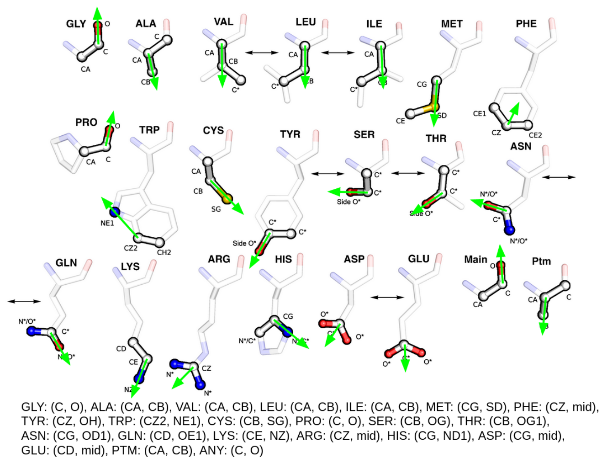

Understanding Templates
=======================

A template contains a set of catalytic residues and their 3D coordinates while
specifying a set of constraints such as interchangeable amino acid types
and allowable structural flexibility. Templates in our library contain up to 8 residues.

Each residue is represented by three functional atoms, according to its function
as annotated in M-CSA. Residues which interact through both side- and main-chain atoms
are represented by six functional atoms.
For 813 of the current 1004 entries (81%) in the M-CSA, templates have been derived
using our previously published `CSA-3D <https://github.com/iriziotis/CSA-3D>`_ package.
Here, homologous PDB structures were clustered and the representative members
were collected as templates, each describing a consensus active site conformation.
Thus templates account for known differences in conformation.
A given template residue may specify a small selection of chemically equivalent
amino acids (e.g. Asp-Glu, Ser-Thr-Tyr) if such substitutions are observed in
homologous enzymes. This way a template’s constraints may account for both divergence
through conservative missense mutations as well as functional convergence. 
Larger templates are themselves subdivided into smaller composite patterns of fewer
residues describing partial active sites, identified by applying a k-means algorithm
in 3D. The exact methodology is described by Riziotis et al.([1]_, [2]_).

Thus by subdivision of larger templates and considering alternate catalytic
conformations, a total number of 6780 templates from 1412 PDB structures across
762 M-CSA enzyme families were used for analysis. Only the number of unique
and defined residues interacting through their side chain in a template are counted
towards its size. Thus, residues with six functional atoms are counted only once and
residues allowed to match any amino acid type are not counted. This was done in order
to make selectivity more comparable to template size as atoms allowed to match to
backbone atoms of any residue type were observed to be much less selective.
The size distribution of our template library as given by unique, specific residues
is shown in the figure below. While we provide our library of templates, users may also
use their own templates. Templates make use of a modified PDB-like format.

Template annotations such as EC number, CATH accession and InterPro annotations
were collected from the M-CSA. The residue order and the adjusted number of unique,
specific residues in each template are calculated alongside the orientation of each
template residue given by an amino acid type dependent vector.

Template format
^^^^^^^^^^^^^^^

Templates follow a `PDB-like format <https://www.cgl.ucsf.edu/chimera/docs/UsersGuide/tutorials/pdbintro.html>`_
and can be viewed with any 3D molecular viewer.
However there are some important differences! Here is an example template:

.. code::

    REMARK TEMPLATE
    REMARK CLUSTER 1_1_3
    REMARK REPRESENTING 98 CATALYTIC SITES
    REMARK ID 2b00_A30-A49-A32-A99-A48-A52-A73-A28
    REMARK MCSA_ID 83
    REMARK PDB_ID 2b00
    REMARK UNIPROT_ID P00592
    REMARK EC 3.1.1.4
    REMARK ENZYME Phospholipase A2, major isoenzyme (E.C.3.1.1.4)
    REMARK EXPERIMENTAL_METHOD X-ray diffraction
    REMARK RESOLUTION 1.85
    REMARK ORGANISM_NAME Sus scrofa
    REMARK ORGANISM_ID 9823
    ATOM      3  CG ZASP A  49      53.884  30.337 -19.252 DE    1.58 
    ATOM      3  OD1ZASP A  49      53.925  29.108 -19.020 DE    1.58 
    ATOM      3  OD2ZASP A  49      54.224  31.199 -18.410 DE    1.58 
    ATOM      0  CG ZHIS A  48      54.901  25.176 -21.978 H     0.49 
    ATOM      8  ND1ZHIS A  48      54.208  25.149 -20.788 H     0.49 
    ATOM      8  CD2ZHIS A  48      54.622  24.007 -22.603 H     0.49 
    ATOM      3  CE1ZTYR A  52      50.408  23.549 -22.426 Y     0.65 
    ATOM      3  CZ ZTYR A  52      50.163  23.096 -21.135 Y     0.65 
    ATOM      1  OH ZTYR A  52      50.483  21.810 -20.769 Y     0.65 
    END

- `REMARK` lines provide some information about the Template
- Templates are derived by clustering homologous experimental enzyme structures. Each template represents the central member of each cluster and therefore comes from a real structure.
- Usually this is be biological assembly in `mmCIF` format
- Cluster assignment information is given in the format [`cluster_id`, `cluster_member`, `cluster_size`]

.. note::
    As detailed above, each residue is represented by 3 functional atoms.
    A figure is shown below. Thus, this template with 9 atoms is composed of 3 residues. 

The columns analogous to PDB file format are (with 0-based indexing):

- 0-3 `ATOM` - Never `HETATM``
- 8-10 match mode code
- 12-15 Atom name
- 16 `Z`
- 17-19 Residue name (3-letter-code)
- 20-21 Chain identifier (may be two characters!)
- 22-25 Residue number
- 30-37 x-coordinate
- 38-45 y-coordinate
- 46-53 z-coordinate
- 55-59 Alternative canonical amino-acids (single-letter-code; up to 5 characters)
- 61-64 dynamic matching distance

.. caution::
    Based on how well individual atoms superpose for a cluster of templates,
    a dynamic matching distance is defined on a per-atom basis.
    (if for example a single residue is flexible and is allowed to be matched with more
    relaxed spatial constraints). This dynamic distance of an atom is optionally
    defined on the B-factor field of the `ATOM` record in the template.

    Internally matches may not exceed the sum of the global `pairwise_distance` cutoff
    and the so called `max_dynamic_distance`.
    To override dynamic distance completely, you can set the `max_dynamic_distance` equal
    to the global `pairwise_distance` argument. By default this is the case such that this
    column does not affect matching in **EnzyMM** but you can change that!

Template Atoms and Residue Orientations
^^^^^^^^^^^^^^^^^^^^^^^^^^^^^^^^^^^^^^^

Each residue in a template is represented by three functional atoms each.
Atoms which define a residue are emphasised.
Bidirectional arrows indicate residues of equivalent properties that
can be superposed interchangeably. Similarly, atoms of symmetrical chemical groups or
atoms that are shared between equivalent residues are indicated with a `*` symbol.
For each 3-atom residue in the template an orientation vector depending on
the amino acid type is defined. Green arrows indicate this residue orientation vector.
Atom names as defined by the PDB are show below. 
`mid` refers to the euclidean midpoint between the two other atoms.
This figure was adapted from Riziotis et al. [2]_.

Match Modes
^^^^^^^^^^^
Only heavy atoms are ever matched.
Templates only use the match mode codes `0`, `1`, `3`, `8` and `100`:

- `0` : An exact match on both atom name and residue name(s)
- `1` : An exact match on residue name(s) and any non-carbon side-chain atom.
- `3` : Atom type and residue name(s) must match
- `8` : Any atom in the same position in the allowed residue(s)
- `100`: An exact match on the atom name

.. note::
    Further match modes are defined in `jess/src/TessAtom.c`

.. [1] Riziotis, I. G.; Ribeiro, A. J. M.; Borkakoti, N.; Thornton, J. M. Conformational Variation in Enzyme Catalysis: A Structural Study on Catalytic Residues. Journal of Molecular Biology 2022, 434(7), 167517. doi:10.1016/j.jmb.2022.167517.
.. [2] Riziotis, I. G.; Ribeiro, A. J. M.; Borkakoti, N.; Thornton, J. M. The 3D modules of enzyme catalysis: deconstructing active sites into distinct functional entities. bioRxiv June 5, 2023, p 2023.06.01.543252. doi:10.1101/2023.06.01.543252.